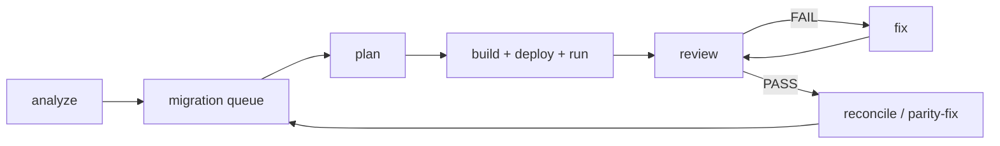

## Overview

Lakebridge's transpilers convert most SQL deterministically. Procedural code — stored procedures
with cursors, temp tables, multi-step `MERGE` logic or dynamic SQL — usually needs a person to finish
the conversion, validate it against the legacy system and fix differences. The Lakebridge plugin
for [Claude Code](https://docs.claude.com/en/docs/claude-code) automates that loop with AI agents
that use the Lakebridge and Databricks CLIs.

The plugin is made of prompts only. It adds no dependencies to Lakebridge and runs entirely on your
machine with your own CLI credentials.



## Prerequisites

- Lakebridge installed and configured (see [Installation](/docs/installation)), with the transpiler
  for your source dialect installed (`databricks labs lakebridge install-transpile`).
- For validation: Lakebridge reconcile configured (`databricks labs lakebridge configure-reconcile`),
  or a read-only query tool for the source system.
- Claude Code.

## Install the plugin

In Claude Code:

```
/plugin marketplace add databrickslabs/lakebridge
/plugin install lakebridge@lakebridge
```

## Set up a migration project

Run `/lakebridge:init` in your migration repository. It creates:

| Path | Purpose |
|---|---|
| `migration/migration.config.yml` | Project facts: CLI profile, catalog, schemas, source folders, jobs, rules |
| `migration/queue.md` | One row per legacy object with priority, dependencies and status |
| `migration/ralph/*.md` | Prompts for the Ralph loops |
| `migration/specs`, `reviews`, `fixes`, `sessions` | Plans, review reports, fix reports and resumable session state |

Split monolithic SQL files with the [SQL Splitter](/docs/sql_splitter) and run the
[Analyzer](/docs/assessment/analyzer/) first; Claude uses the analyzer report to seed and order the queue.

Run `/lakebridge:prime` at the start of each session to load the config and queue and check that the
CLIs are authenticated.

## Migrate one object

Ask Claude to migrate an object, for example *"migrate dbo.usp_LoadSalesFact"*. The `migrate-object`
skill runs four subagents in turn:

1. **Planner** reads the whole source object, records its contract (keys, joins, filters,
   deduplication, calculated columns, post-write steps), runs `databricks labs lakebridge transpile`
   and writes a plan.
2. **Builder** implements the plan, deploys it, runs it on Databricks and records validation
   evidence.
3. **Reviewer** compares the legacy contract with the new code line by line, read-only, and writes
   a report with BLOCKER / HIGH / MEDIUM / LOW issues and a PASS/FAIL verdict.
4. **Fixer** runs only on FAIL. It fixes BLOCKER and HIGH issues and revalidates; then a fresh
   reviewer checks again, up to a configured number of attempts.

Each phase runs in its own subagent, so the reviewer judges the builder's work independently.

## Fix data differences

When reconcile shows a migrated table doesn't match, the `parity-fix` skill works in a fixed order:

1. Read the legacy logic that populates the table.
2. Compare schemas (reconcile `report_type: schema`) and fix those first.
3. Count rows per layer to find where the difference first appears.
4. Compare at key level (reconcile `report_type: data`) and inspect sample rows.
5. Confirm the root cause with a query, fix it at that layer, and rerun the checks.

It never copies rows from the legacy table into the target to make counts match unless you
explicitly allow it.

## Run and self-heal jobs

The `run-and-monitor` skill runs a Databricks job, watches each task, and sorts failures into
schema, data, code, dependency or infra. It writes a fix plan, applies only fixes that are safe to
automate, and repairs the run. It stops after three attempts, when the same errors repeat, or when
only infrastructure problems remain. Those go back to you.

## Ralph loops

A [Ralph loop](https://github.com/anthropics/claude-code/tree/main/plugins/ralph-wiggum) feeds Claude
the same prompt repeatedly until it outputs a completion promise. Claude's memory between iterations
is the files it committed, not the conversation, so long migrations survive context limits and
restarts. Install Anthropic's `ralph-wiggum` plugin, then:

| Loop | What one iteration does | Ends when |
|---|---|---|
| `migrate-queue` | Migrates the next runnable object in `queue.md` and commits | No pending objects remain, or everything left is blocked |
| `parity-sweep` | Fixes one mismatched table | Every table matches or has an explained difference |
| `stabilize-job` | Runs a job, fixes failures, logs the result | The job succeeds twice in a row, or only infra issues remain |

```
/ralph-loop "Follow the instructions in migration/ralph/migrate-queue.md" --completion-promise "ALL_OBJECTS_MIGRATED" --max-iterations 60
```

`/lakebridge:ralph` prepares each loop and gives you the exact command. `/cancel-ralph` stops a loop.
Every iteration commits, so `git log` is the progress report, and a loop restarted later picks up
where it stopped.

## Expert commands

| Command | Covers |
|---|---|
| `/lakebridge:expert-lakebridge` | Lakebridge CLI commands, transpile error triage, reconcile report types and options |
| `/lakebridge:expert-databricks` | Serverless and access-mode limits, Delta patterns, ID and time-zone pitfalls, deployment |
| `/lakebridge:expert-tsql-to-spark` | T-SQL type, function and procedural-pattern conversions, and what transpilers commonly get wrong |

## Safety

- The agents use your CLI credentials and can write to your workspace. Use a development catalog and
  a branch, and review commits before merging.
- Keep secrets out of `migration.config.yml`. Reference CLI profiles and secret scopes by name.
- The reviewer is read-only. The builder, fixer and job skill run jobs and write tables. Loops commit
  to the current branch.
