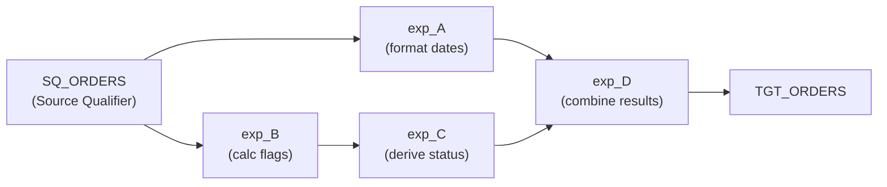
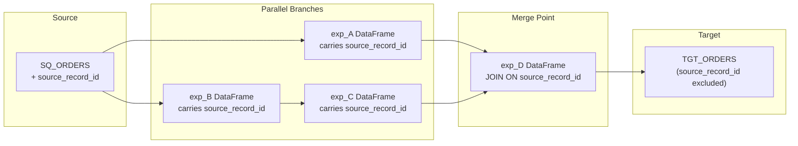
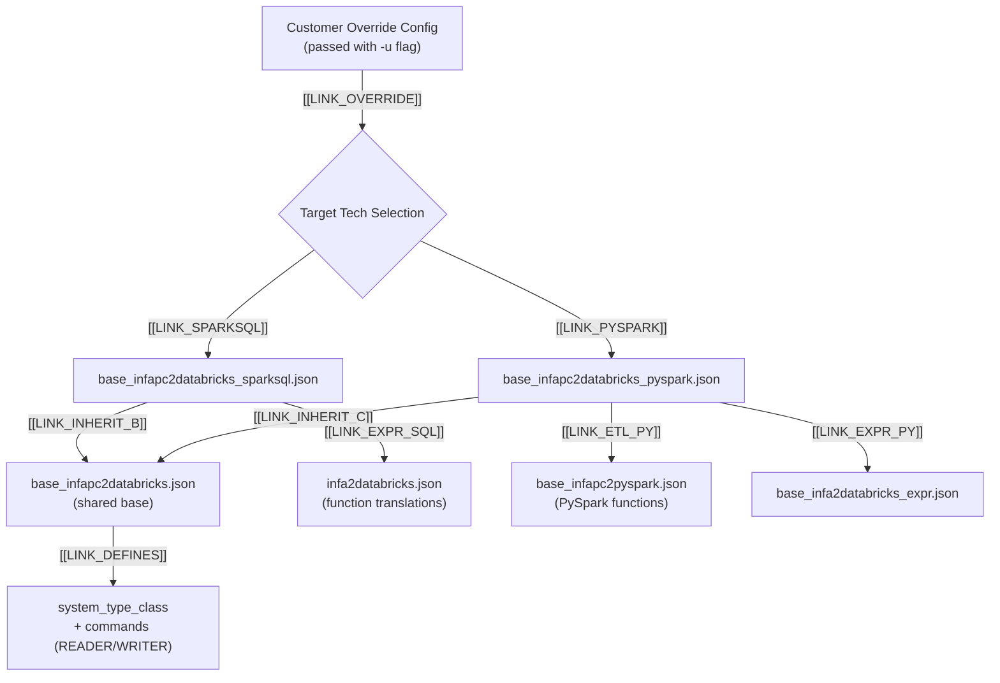

# Informatica PowerCenter to Databricks

## Getting Started

### Conversion Information

* **Transpiler**: BladeBridge
* **Conversion approach**: Lift and shift - the converter translates PowerCenter logic to equivalent Databricks code while preserving the original structure and flow
* **Available targets**: Databricks Notebooks (SparkSQL or PySpark)

### Supported PowerCenter Versions

- PowerCenter 9.x, 10.x
- PowerCenter Repository Services

### Input Requirements

Export your PowerCenter mappings and workflows as XML files using the PowerMart XML format:

1. **Repository Manager Export**: Use the Export Objects wizard in PowerCenter Repository Manager
2. **pmrep Command**: Use `pmrep objectexport` to export objects programmatically
3. **Designer Export**: Export from PowerCenter Designer (File → Export Objects)

**Export from Repository Manager:**
1. Open Repository Manager and connect to your repository
2. Select the folder(s) containing your mappings and workflows
3. Right-click → Export Objects
4. Choose "PowerMart XML" format
5. Save the `.xml` file

**Export using pmrep:**
```bash
pmrep connect -r REPOSITORY_NAME -d DOMAIN_NAME -n USERNAME -x PASSWORD
pmrep objectexport -o folder -n FOLDER_NAME -f exported_folder.xml
```

**Sample XML Structure:**
```xml
<?xml version="1.0" encoding="UTF-8"?>
<!DOCTYPE POWERMART SYSTEM "powrmart.dtd">
<POWERMART CREATION_DATE="06/05/2024 10:30:00" REPOSITORY_VERSION="187.96">
  <REPOSITORY NAME="REPO_NAME" VERSION="187" CODEPAGE="UTF-8" DATABASETYPE="Oracle">
    <FOLDER NAME="ETL_FOLDER" ...>
      <SOURCE ... />
      <TARGET ... />
      <MAPPING ... />
      <WORKFLOW ... />
    </FOLDER>
  </REPOSITORY>
</POWERMART>
```

---

## What Gets Converted

### High-Level Conversion Overview

PowerCenter objects are converted to their Databricks equivalents as follows:

| PowerCenter Object | Databricks Equivalent | Description |
|--------------------|----------------------|-------------|
| **Mapping** | Databricks Notebook | Each mapping is converted to a notebook containing PySpark or SparkSQL code (based on user selection) |
| **Session** | Databricks Notebook | Sessions execute mappings and are converted to notebook tasks |
| **Workflow** | Databricks Workflow | Workflows are converted to Databricks Workflow JSON definitions that orchestrate notebook execution |
| **Worklet** | Databricks Workflow | Reusable worklets are converted to separate Databricks Workflows |
| **Mapplet** | Shared Python Module | Reusable mapplets are converted to Python functions in a `shared_functions/` folder |

**Orchestration Flow:**

The converted Databricks Workflow calls individual PySpark or SparkSQL notebooks in sequence, mimicking the original execution flow of the PowerCenter workflow. Task dependencies, success/failure paths, and conditional logic are preserved in the workflow definition.

**Mapping Flow Preservation:**

The converter preserves the data flow of the original mapping. Transformations are processed in the same order as defined in PowerCenter, maintaining the logical sequence of operations from source to target.

**Session Overrides:**

Session-level and workflow-level overrides are taken into account during conversion. If SQL statements, connection properties, or other settings are overridden at the session or workflow level, the converted PySpark or SparkSQL code will reflect those overrides rather than the base mapping definitions.

**Naming Conventions:**

The converter preserves the original naming conventions for all artifacts - workflows, mappings, sessions, and individual transformation components. This makes it easy to correlate source PowerCenter objects with their converted Databricks equivalents during validation and debugging.

```
PowerCenter Workflow          →    Databricks Workflow JSON
    ├── Session 1 (Mapping A) →        ├── Notebook Task: mapping_a.py
    ├── Session 2 (Mapping B) →        ├── Notebook Task: mapping_b.py
    └── Worklet (sub-flow)    →        └── Nested Workflow Task
```

**Temporary Views for Data Lineage:**

Each transformation DataFrame is registered as a Spark temporary view using `createOrReplaceTempView()`. This allows downstream transformations to reference the data using SQL queries, maintaining the logical flow of the PowerCenter mapping.

```python
exp_CALC_TOTALS = spark.sql(rf"""SELECT ... FROM source_table""")
exp_CALC_TOTALS.createOrReplaceTempView("`exp_CALC_TOTALS`")

# Downstream transformation can now reference it
FIL_VALID = spark.sql(rf"""SELECT * FROM `exp_CALC_TOTALS` WHERE amount > 0""")
```

### Row Lineage Tracking

In PowerCenter, rows flow through a pipeline of transformations where a single source row can be processed by multiple components. Each transformation in the converted code becomes a separate DataFrame. When the data flow splits (one component feeding multiple downstream components) and later merges back together, the converter must ensure the correct rows are joined together across DataFrames.

This is particularly important for **passive transformations** (like Expression) that don't change row counts - every input row produces exactly one output row, so the lineage must be preserved.

**The Problem:**

Consider a typical Informatica mapping where a Source Qualifier feeds multiple Expression transformations that later need to be combined:



In this flow, `exp_D` needs to combine results from `exp_A` and `exp_C`. Since each transformation becomes a separate DataFrame in the converted code, how do we know which row from `exp_A` should be joined with which row from `exp_C`? They both originated from the same source row, but without an identifier, there's no way to correlate them.

**The Solution - `source_record_id` Column:**

The converter generates a synthetic row identifier column called `source_record_id` at the Source Qualifier using the `xxhash64()` hash function. This column is computed from the row's natural key columns and is propagated through all downstream transformations, linking the DataFrames together.

```python
# Source Qualifier generates the source_record_id
SQ_ORDERS = spark.sql(rf"""
SELECT
    ORDER_ID,
    CUST_ID,
    ORDER_AMT,
    ORDER_DATE,
    xxhash64(concat_ws('||', ORDER_ID, CUST_ID, ORDER_AMT, ORDER_DATE)) as source_record_id
FROM ORDERS
""")
SQ_ORDERS.createOrReplaceTempView("`SQ_ORDERS`")
```

**How Row Lineage Works:**

Each DataFrame (representing an Informatica component) carries the `source_record_id` column. When transformations merge, they join on this column to ensure the correct rows are combined. The synthetic column is used only within the pipeline - it is **not written to the target**.



**Generated Code Example:**

```python
# Source Qualifier - generates source_record_id from all source columns
SQ_ORDERS = spark.sql(rf"""
SELECT *, xxhash64(concat_ws('||', ORDER_ID, CUST_ID, ORDER_AMT, ORDER_DATE)) as source_record_id
FROM ORDERS
""")
SQ_ORDERS.createOrReplaceTempView("`SQ_ORDERS`")

# exp_A - format dates (carries source_record_id)
exp_A = spark.sql(rf"""
SELECT 
    source_record_id,
    ORDER_ID,
    ORDER_AMT,
    DATE_FORMAT(ORDER_DATE, 'yyyy-MM-dd') as ORDER_DATE_FMT
FROM `SQ_ORDERS`
""")
exp_A.createOrReplaceTempView("`exp_A`")

# exp_B - calculate flags (carries source_record_id)
exp_B = spark.sql(rf"""
SELECT 
    source_record_id,
    ORDER_ID,
    CASE WHEN ORDER_AMT > 1000 THEN 'Y' ELSE 'N' END as HIGH_VALUE_FLAG
FROM `SQ_ORDERS`
""")
exp_B.createOrReplaceTempView("`exp_B`")

# exp_C - derive status from exp_B (carries source_record_id)
exp_C = spark.sql(rf"""
SELECT 
    source_record_id,
    ORDER_ID,
    HIGH_VALUE_FLAG,
    CASE WHEN HIGH_VALUE_FLAG = 'Y' THEN 'PRIORITY' ELSE 'NORMAL' END as ORDER_STATUS
FROM `exp_B`
""")
exp_C.createOrReplaceTempView("`exp_C`")

# exp_D - combine results from exp_A and exp_C using source_record_id
exp_D = spark.sql(rf"""
SELECT
    a.ORDER_ID,
    a.ORDER_AMT,
    a.ORDER_DATE_FMT,
    c.HIGH_VALUE_FLAG,
    c.ORDER_STATUS
FROM `exp_A` a
INNER JOIN `exp_C` c
    ON a.source_record_id = c.source_record_id
""")
exp_D.createOrReplaceTempView("`exp_D`")

# Target - source_record_id is NOT written to the target
spark.sql(rf"""
INSERT INTO TGT_ORDERS (ORDER_ID, ORDER_AMT, ORDER_DATE, HIGH_VALUE_FLAG, ORDER_STATUS)
SELECT ORDER_ID, ORDER_AMT, ORDER_DATE_FMT, HIGH_VALUE_FLAG, ORDER_STATUS
FROM `exp_D`
""")
```

**Key Points:**

- Each Informatica transformation component becomes a DataFrame in the converted code
- The `source_record_id` column is the link that correlates rows across DataFrames
- This is essential for passive transformations where row counts don't change but data flows split and merge
- When data flows split and merge, the join on `source_record_id` ensures the correct rows are combined
- The `source_record_id` is a pipeline-internal column - it is **not written to the target table**
- This approach mimics how PowerCenter internally tracks rows through the mapping pipeline

---

### Transformations - Supported

#### Source Components

| PowerCenter Component | Type | Spark Equivalent | Notes |
|-----------------------|------|------------------|-------|
| **Source Qualifier** | Source Qualifier | `spark.read` / SQL SELECT | Relational source reads |
| **Application Source Qualifier** | Source Qualifier | `spark.read` / SQL SELECT | Application-specific sources |
| **XML Source Qualifier** | Source Qualifier | `spark.read.format("xml")` | XML data sources |

#### Active Transformations

Active transformations can change the number of rows that pass through them. For example, a Filter removes rows, an Aggregator groups rows, and a Router splits rows into multiple output groups.

| PowerCenter Component | Type | Spark Equivalent | Notes |
|-----------------------|------|------------------|-------|
| **Expression** | Expression | SELECT with expressions | Column calculations |
| **Filter** | Filter | WHERE clause | Row filtering |
| **Router** | Router | Multiple WHERE clauses | Conditional routing to groups |
| **Aggregator** | Aggregator | GROUP BY | AVG, COUNT, MAX, MIN, SUM, etc. |
| **Joiner** | Joiner | JOIN (INNER, LEFT, RIGHT, FULL) | Sorted/unsorted joins |
| **Sorter** | Sorter | ORDER BY | Sorting operations |
| **Union Transformation** | Union | UNION ALL | Combine multiple sources |
| **Update Strategy** | Update Strategy | MERGE / Delta operations | INSERT, UPDATE, DELETE, REJECT |
| **Rank** | Rank | ROW_NUMBER / RANK | Ranking transformations |
| **Sequence Generator** | Sequence | MONOTONICALLY_INCREASING_ID | Sequence number generation |
| **Normalizer** | Normalizer | UNPIVOT / EXPLODE | VSAM and normalized data. Note: Normalizer as a source is currently not supported |

#### Passive Transformations

Passive transformations do not change the number of rows - every input row produces exactly one output row. These transformations modify or enrich data without affecting row counts.

| PowerCenter Component | Type | Spark Equivalent | Notes |
|-----------------------|------|------------------|-------|
| **Lookup** | Lookup Procedure | LEFT JOIN | Connected and unconnected lookups. Matching strategy (First, Last, Any, All matches) is preserved. Lookups are generated at the beginning of the script as prerequisite objects for easier tracing |
| **Stored Procedure** | Stored Procedure | spark.sql() with CALL | Procedure execution |

#### Target Components

| PowerCenter Component | Type | Spark Equivalent | Notes |
|-----------------------|------|------------------|-------|
| **Target Definition** | Target | INSERT INTO / Delta write | Relational and flat file targets |

#### Workflow Components

| PowerCenter Component | Type | Databricks Equivalent | Notes |
|-----------------------|------|----------------------|-------|
| **Workflow** | Orchestration | Databricks Workflow JSON | Job orchestration |
| **Session** | Execution | Notebook task | Mapping execution |
| **Worklet** | Reusable workflow | Nested workflow | Reusable workflow components |

### Transformations - Unsupported

The following transformations require manual conversion:

| PowerCenter Component | Reason |
|-----------------------|--------|
| **Java Transformation** | Custom Java code requires manual translation to Python |
| **External Procedure** | External calls need manual implementation |
| **Custom Transformation** | Custom logic requires manual conversion |
| **HTTP Transformation** | Implement using Python `requests` library |
| **SQL Transformation** | Review and adapt embedded SQL |

:::warning Custom Code
Transformations containing **custom Java code**, **external procedures**, or **stored procedures with complex logic** cannot be automatically converted. However, these transformation types are not commonly used in typical PowerCenter implementations and generally represent a small percentage of overall code. Any such components will require manual code translation to Python/SQL, or can be addressed using a post-conversion automated tool tailored to your specific use case.
:::

---

### Sources and Targets

#### Supported Source Types

| Source Type | DATABASETYPE | System Class | Reader Command |
|-------------|--------------|--------------|----------------|
| Oracle | Oracle | RELATIONAL | `spark.read.jdbc()` / SQL |
| SQL Server | Microsoft SQL Server | RELATIONAL | `spark.read.jdbc()` / SQL |
| MySQL | MySQL | RELATIONAL | `spark.read.jdbc()` / SQL |
| Teradata | Teradata | RELATIONAL | `spark.read.jdbc()` / SQL |
| DB2 | DB2 | RELATIONAL | `spark.read.jdbc()` / SQL |
| Flat File | Flat File | FILE_DELIMITED | `spark.read.csv()` |
| Fixed Width | Flat File | FILE_FIXED | `spark.read.text()` with parsing |

#### Supported Target Types

| Target Type | System Class | Writer Command |
|-------------|--------------|----------------|
| Delta Lake | RELATIONAL | `INSERT INTO` / Delta write |
| Flat File | FILE_DELIMITED | `df.write.csv()` |

---

## Conversion Examples

The following examples show how PowerCenter transformations are converted to both SparkSQL and PySpark output formats.

### Expression Transformation

**PowerCenter Expression:**
```
Expression Transformation: exp_CALC_TOTALS
  Ports:
    GROSS_AMOUNT (Input)
    TAX_RATE (Input)
    NET_AMOUNT = GROSS_AMOUNT * (1 - TAX_RATE)
    PROCESS_DATE = SYSDATE
```

#### SparkSQL Output

```python
# Processing node exp_CALC_TOTALS, type EXPRESSION
exp_CALC_TOTALS = spark.sql(rf"""
SELECT
    source_record_id,
    GROSS_AMOUNT,
    TAX_RATE,
    GROSS_AMOUNT * (1 - TAX_RATE) AS NET_AMOUNT,
    CURRENT_TIMESTAMP() AS PROCESS_DATE
FROM `SQ_SOURCE`
""")
exp_CALC_TOTALS.createOrReplaceTempView("`exp_CALC_TOTALS`")
```

#### PySpark Output

```python
# Processing node exp_CALC_TOTALS, type EXPRESSION
exp_CALC_TOTALS = SQ_SOURCE.select(
    col('sys_row_id'),
    col('GROSS_AMOUNT'),
    col('TAX_RATE'),
    (col('GROSS_AMOUNT') * (1 - col('TAX_RATE'))).alias('NET_AMOUNT'),
    current_timestamp().alias('PROCESS_DATE')
)
```

### Lookup Transformation

Lookups are generated at the beginning of the converted script as **prerequisite objects**, making them easy to trace and ensuring data is cached before the main processing begins.

**PowerCenter Lookup:**
```
Lookup Transformation: LKP_CUSTOMER
  Lookup Table: DIM_CUSTOMER
  Lookup Condition: CUST_ID = IN_CUST_ID
  Return Ports: CUST_NAME, CUST_REGION
  Cache: Full Cache
  Matching Strategy: First Match
```

#### SparkSQL Output

```python
# COMMAND ----------
# Component LKP_CUSTOMER, Type SOURCE Prerequisite Lookup Object
LKP_CUSTOMER = spark.sql(rf"""
SELECT
    CUST_ID,
    CUST_NAME,
    CUST_REGION
FROM DIM_CUSTOMER
WHERE ACTIVE_FLAG = 'Y'
""")
LKP_CUSTOMER.createOrReplaceTempView("`LKP_CUSTOMER`")

# COMMAND ----------
# Later in the script - using the lookup in a join
exp_ENRICHED = spark.sql(rf"""
SELECT
    src.source_record_id,
    src.ORDER_ID,
    src.CUST_ID,
    lkp.CUST_NAME,
    lkp.CUST_REGION
FROM `SQ_ORDERS` src
LEFT JOIN `LKP_CUSTOMER` lkp
    ON src.CUST_ID = lkp.CUST_ID
""")
exp_ENRICHED.createOrReplaceTempView("`exp_ENRICHED`")
```

#### PySpark Output

```python
# Prerequisite Lookup Object
LKP_CUSTOMER_SRC = spark.sql(f"""
SELECT CUST_ID, CUST_NAME, CUST_REGION
FROM DIM_CUSTOMER WHERE ACTIVE_FLAG = 'Y'
""")

# Lookup join with First Match strategy using window function
LKP_CUSTOMER_result = exp_INPUT.join(
    LKP_CUSTOMER_SRC,
    exp_INPUT.CUST_ID == LKP_CUSTOMER_SRC.CUST_ID,
    'left'
).withColumn(
    'row_num',
    row_number().over(Window.partitionBy('sys_row_id').orderBy('CUST_NAME'))
)
# Filter to first match only
LKP_CUSTOMER = LKP_CUSTOMER_result.filter(col('row_num') == 1).select(
    exp_INPUT['*'],
    LKP_CUSTOMER_SRC.CUST_NAME,
    LKP_CUSTOMER_SRC.CUST_REGION
)
```

### Router Transformation

**PowerCenter Router:**
```
Router Transformation: RTR_BY_REGION
  Groups:
    NORTH: REGION = 'NORTH'
    SOUTH: REGION = 'SOUTH'
    DEFAULT: (all other rows)
```

#### SparkSQL Output

```python
# Processing node RTR_BY_REGION, type ROUTER
# Group: NORTH
RTR_BY_REGION_NORTH = spark.sql(rf"""
SELECT * FROM `SQ_SOURCE`
WHERE REGION = 'NORTH'
""")
RTR_BY_REGION_NORTH.createOrReplaceTempView("`RTR_BY_REGION_NORTH`")

# Group: SOUTH
RTR_BY_REGION_SOUTH = spark.sql(rf"""
SELECT * FROM `SQ_SOURCE`
WHERE REGION = 'SOUTH'
""")
RTR_BY_REGION_SOUTH.createOrReplaceTempView("`RTR_BY_REGION_SOUTH`")

# Group: DEFAULT
RTR_BY_REGION_DEFAULT = spark.sql(rf"""
SELECT * FROM `SQ_SOURCE`
WHERE NOT (REGION = 'NORTH' OR REGION = 'SOUTH')
""")
RTR_BY_REGION_DEFAULT.createOrReplaceTempView("`RTR_BY_REGION_DEFAULT`")
```

#### PySpark Output

```python
# Processing node RTR_BY_REGION, type ROUTER
# Group: NORTH
RTR_BY_REGION_NORTH = SQ_SOURCE.filter(col('REGION') == 'NORTH')

# Group: SOUTH
RTR_BY_REGION_SOUTH = SQ_SOURCE.filter(col('REGION') == 'SOUTH')

# Group: DEFAULT
RTR_BY_REGION_DEFAULT = SQ_SOURCE.filter(~((col('REGION') == 'NORTH') | (col('REGION') == 'SOUTH')))
```

### Aggregator Transformation

**PowerCenter Aggregator:**
```
Aggregator Transformation: AGG_SALES_BY_REGION
  Group By: REGION, PRODUCT_ID
  Aggregates:
    TOTAL_SALES = SUM(SALE_AMOUNT)
    AVG_PRICE = AVG(UNIT_PRICE)
    ORDER_COUNT = COUNT(ORDER_ID)
```

#### SparkSQL Output

```python
# Processing node AGG_SALES_BY_REGION, type AGGREGATOR
AGG_SALES_BY_REGION = spark.sql(rf"""
SELECT
    REGION,
    PRODUCT_ID,
    SUM(SALE_AMOUNT) AS TOTAL_SALES,
    AVG(UNIT_PRICE) AS AVG_PRICE,
    COUNT(ORDER_ID) AS ORDER_COUNT
FROM `SQ_SALES`
GROUP BY REGION, PRODUCT_ID
""")
AGG_SALES_BY_REGION.createOrReplaceTempView("`AGG_SALES_BY_REGION`")
```

#### PySpark Output

```python
# Processing node AGG_SALES_BY_REGION, type AGGREGATOR
AGG_SALES_BY_REGION = SQ_SALES.groupBy(
    col('REGION'),
    col('PRODUCT_ID')
).agg(
    sum('SALE_AMOUNT').alias('TOTAL_SALES'),
    avg('UNIT_PRICE').alias('AVG_PRICE'),
    count('ORDER_ID').alias('ORDER_COUNT')
)
```

### Joiner Transformation

**PowerCenter Joiner:**
```
Joiner Transformation: JNR_ORDER_CUSTOMER
  Join Type: Master Outer (RIGHT OUTER)
  Join Condition: MASTER.CUST_ID = DETAIL.CUST_ID
  Master: CUSTOMERS
  Detail: ORDERS
```

#### SparkSQL Output

```python
# Processing node JNR_ORDER_CUSTOMER, type JOINER
JNR_ORDER_CUSTOMER = spark.sql(rf"""
SELECT
    detail.source_record_id,
    detail.ORDER_ID,
    detail.CUST_ID,
    master.CUST_NAME,
    master.CUST_ADDRESS
FROM `SQ_ORDERS` detail
RIGHT OUTER JOIN `SQ_CUSTOMERS` master
    ON master.CUST_ID = detail.CUST_ID
""")
JNR_ORDER_CUSTOMER.createOrReplaceTempView("`JNR_ORDER_CUSTOMER`")
```

#### PySpark Output

```python
# Processing node JNR_ORDER_CUSTOMER, type JOINER
JNR_ORDER_CUSTOMER = SQ_ORDERS.join(
    SQ_CUSTOMERS,
    SQ_ORDERS.CUST_ID == SQ_CUSTOMERS.CUST_ID,
    'right'
).select(
    SQ_ORDERS.sys_row_id,
    SQ_ORDERS.ORDER_ID,
    SQ_ORDERS.CUST_ID,
    SQ_CUSTOMERS.CUST_NAME,
    SQ_CUSTOMERS.CUST_ADDRESS
)
```

### Sorter Transformation

**PowerCenter Sorter:**
```
Sorter Transformation: SRT_BY_DATE
  Sort Keys:
    ORDER_DATE (Descending)
    CUST_ID (Ascending)
```

#### SparkSQL Output

```python
# Processing node SRT_BY_DATE, type SORTER
SRT_BY_DATE = spark.sql(rf"""
SELECT *
FROM `exp_INPUT`
ORDER BY ORDER_DATE DESC, CUST_ID ASC
""")
SRT_BY_DATE.createOrReplaceTempView("`SRT_BY_DATE`")
```

#### PySpark Output

```python
# Processing node SRT_BY_DATE, type SORTER
SRT_BY_DATE = exp_INPUT.select('*').sort(
    col('ORDER_DATE').desc(),
    col('CUST_ID').asc()
)
```

### Update Strategy Transformation

The Update Strategy transformation determines whether each row should be inserted, updated, deleted, or rejected. The converter translates the strategy expression and adds an `UPDATE_STRATEGY_ACTION` column with numeric values that mimic how Informatica handles row disposition:

| Informatica Constant | Numeric Value | Action |
|---------------------|---------------|--------|
| DD_INSERT | 0 | Insert row |
| DD_UPDATE | 1 | Update row |
| DD_DELETE | 2 | Delete row |
| DD_REJECT | 3 | Reject row |

**PowerCenter Update Strategy:**
```
Update Strategy Transformation: UPD_CUSTOMER
  Strategy Expression:
    IIF(ISNULL(EXISTING_KEY), DD_INSERT,
        IIF(CHANGE_FLAG = 'D', DD_DELETE, DD_UPDATE))
```

#### SparkSQL Output

```python
# Processing node UPD_CUSTOMER, type UPDATE_STRATEGY
UPD_CUSTOMER = spark.sql(rf"""
/* UPDATE_STRATEGY_ACTION = 0 FOR INSERT / UPDATE_STRATEGY_ACTION = 1 FOR UPDATE / UPDATE_STRATEGY_ACTION = 2 FOR DELETE / UPDATE_STRATEGY_ACTION = 3 FOR REJECT */
SELECT
    exp_SOURCE.CUST_ID as CUST_ID,
    exp_SOURCE.CUST_NAME as CUST_NAME,
    exp_SOURCE.CHANGE_FLAG as CHANGE_FLAG,
    exp_SOURCE.EXISTING_KEY as EXISTING_KEY,
    CASE 
        WHEN exp_SOURCE.EXISTING_KEY IS NULL THEN 0
        WHEN exp_SOURCE.CHANGE_FLAG = 'D' THEN 2
        ELSE 1
    END as UPDATE_STRATEGY_ACTION
FROM `exp_SOURCE`
""")
UPD_CUSTOMER.createOrReplaceTempView("`UPD_CUSTOMER`")

# Target INSERT - rows where UPDATE_STRATEGY_ACTION = 0
spark.sql(rf"""
INSERT INTO CUSTOMER (CUST_ID, CUST_NAME)
SELECT CUST_ID, CUST_NAME
FROM `UPD_CUSTOMER`
WHERE UPDATE_STRATEGY_ACTION = 0
""")

# Target UPDATE/DELETE - using MERGE with UPDATE_STRATEGY_ACTION
spark.sql(rf"""
MERGE INTO CUSTOMER t
USING `UPD_CUSTOMER` s
ON t.CUST_ID = s.CUST_ID AND s.UPDATE_STRATEGY_ACTION IN (1, 2)
WHEN MATCHED AND s.UPDATE_STRATEGY_ACTION = 2 THEN DELETE
WHEN MATCHED AND s.UPDATE_STRATEGY_ACTION = 1 THEN UPDATE SET t.CUST_NAME = s.CUST_NAME
""")
```

#### PySpark Output

```python
# Processing node UPD_CUSTOMER, type UPDATE_STRATEGY
# Adding UPDATE_STRATEGY_ACTION column based on IIF logic
UPD_CUSTOMER = exp_SOURCE.select(
    exp_SOURCE.sys_row_id.alias('sys_row_id'),
    exp_SOURCE.CUST_ID.alias('CUST_ID'),
    exp_SOURCE.CUST_NAME.alias('CUST_NAME'),
    exp_SOURCE.CHANGE_FLAG.alias('CHANGE_FLAG'),
    exp_SOURCE.EXISTING_KEY.alias('EXISTING_KEY')
).withColumn(
    'UPDATE_STRATEGY_ACTION',
    when(col('EXISTING_KEY').isNull(), lit(0))   # DD_INSERT = 0
    .when(col('CHANGE_FLAG') == 'D', lit(2))      # DD_DELETE = 2
    .otherwise(lit(1))                             # DD_UPDATE = 1
)

# Filter and write based on UPDATE_STRATEGY_ACTION
inserts_df = UPD_CUSTOMER.filter(col('UPDATE_STRATEGY_ACTION') == 0)
updates_df = UPD_CUSTOMER.filter(col('UPDATE_STRATEGY_ACTION') == 1)
deletes_df = UPD_CUSTOMER.filter(col('UPDATE_STRATEGY_ACTION') == 2)
```

### Mapplet Conversion

Mapplets are reusable transformation components in PowerCenter. The converter transforms each mapplet into a Python function stored in a `shared_functions/` subfolder, which can be imported and called from any mapping that uses the mapplet.

**PowerCenter Mapplet:**
```
Mapplet: mplt_CUSTOMER_LOOKUP
  Input Group: INPUT (receives customer data)
  Transformations:
    - lkp_CUSTOMER_DETAILS (lookup)
    - exp_ENRICH (expression)
  Output Group: OUTPUT (enriched customer data)
```

**Converted Python Function (`shared_functions/mplt_customer_lookup.py`):**
```python
# Databricks notebook source
from pyspark.sql import *
from pyspark.sql.functions import *

def mplt_customer_lookup(INPUT):
    """
    Mapplet: mplt_CUSTOMER_LOOKUP
    Input: INPUT DataFrame (customer data)
    Output: OUTPUT DataFrame (enriched customer data)
    """
    
    # Prerequisite Lookup Object
    LKP_CUSTOMER_DETAILS_SRC = spark.sql(f"""
    SELECT CUST_ID, CUST_NAME, CUST_REGION, CUST_SEGMENT
    FROM DIM_CUSTOMER
    """)
    
    # Processing node lkp_CUSTOMER_DETAILS, type LOOKUP
    lkp_CUSTOMER_DETAILS = INPUT.join(
        LKP_CUSTOMER_DETAILS_SRC,
        INPUT.CUST_ID == LKP_CUSTOMER_DETAILS_SRC.CUST_ID,
        'left'
    ).select(
        INPUT['*'],
        LKP_CUSTOMER_DETAILS_SRC.CUST_NAME,
        LKP_CUSTOMER_DETAILS_SRC.CUST_REGION,
        LKP_CUSTOMER_DETAILS_SRC.CUST_SEGMENT
    )
    
    # Processing node exp_ENRICH, type EXPRESSION
    OUTPUT = lkp_CUSTOMER_DETAILS.select(
        col('sys_row_id'),
        col('CUST_ID'),
        col('CUST_NAME'),
        upper(col('CUST_REGION')).alias('CUST_REGION_UPPER'),
        col('CUST_SEGMENT'),
        current_timestamp().alias('PROCESS_TS')
    )
    
    return OUTPUT
```

**Calling the Mapplet from a Mapping:**

When a mapping uses a mapplet instance, the converter imports the function and calls it with the appropriate input DataFrame(s):

```python
# Main mapping notebook
from shared_functions.mplt_customer_lookup import mplt_customer_lookup

# Processing source
SQ_ORDERS = spark.sql(rf"""SELECT * FROM ORDERS""")
SQ_ORDERS.createOrReplaceTempView("`SQ_ORDERS`")

# Call mapplet - instance name: MPLT_CUST_LKP_1
MPLT_CUST_LKP_1_OUTPUT = mplt_customer_lookup(SQ_ORDERS)

# Continue processing with mapplet output
exp_FINAL = MPLT_CUST_LKP_1_OUTPUT.select(...)
```

**Mapplet Conversion Rules:**

| Mapplet Element | Python Equivalent |
|-----------------|-------------------|
| Mapplet name | Python function name |
| Input Group(s) | Function parameter(s) - DataFrame(s) |
| Output Group(s) | Function return value(s) - DataFrame(s) |
| Mapplet instance name | Variable receiving the function output |
| Internal transformations | Function body logic |

**Multiple Inputs/Outputs:**

For mapplets with multiple input or output groups, the function signature adjusts accordingly:

```python
# Mapplet with multiple inputs and outputs
def mplt_multi_source(INPUT_ORDERS, INPUT_CUSTOMERS):
    # Processing logic...
    return OUTPUT_VALID, OUTPUT_REJECT
```

```python
# Calling from main mapping
VALID_DATA, REJECTED_DATA = mplt_multi_source(SQ_ORDERS, SQ_CUSTOMERS)
```

### Stored Procedure Calls

PowerCenter stored procedure transformations are converted to `spark.sql()` calls. The scope of execution (pre-load, post-load) is preserved in comments:

**PowerCenter Stored Procedure:**
```
Stored Procedure: sp_SET_INTF_RUNNING
  Connection: Oracle_Target
  Procedure: CDC.SET_INTF_RUNNING
  Parameters: table_id, source_pattern, path_code
  Scope: Pre-Session
```

**Converted Code:**
```python
# Stored procedure call, scope SOURCE_PRE_LOAD
spark.sql("CALL CDC.SET_INTF_RUNNING(:table_id, :source_pattern, :path_code)")
```

---

## Advanced Configuration

### Configuration Inheritance

BladeBridge uses a layered configuration system where configs inherit from base configs and can be overridden by customer-provided configs.



**Key Config Files:**

| Config File | Purpose |
|-------------|---------|
| `base_infapc2databricks_sparksql.json` | SparkSQL output generation |
| `base_infapc2databricks_pyspark.json` | PySpark output generation |
| `base_infapc2databricks.json` | Shared base configuration |
| `infa2databricks.json` | Date/time and function translations |
| `base_infapc2pyspark.json` | PySpark-specific function mapping |

### Custom Config Overrides

Customers can provide their own config file to extend or override default settings using the `-u` flag:

```bash
databricks labs lakebridge transpile \
  --source-dialect "informatica (desktop edition)" \
  --input-source /path/to/xml/files \
  --output-folder /output/notebooks \
  -u /path/to/my_custom_config.json
```

**Example Custom Config (inheriting from base):**
```json
{
  "inherit_from": ["base_infapc2databricks_sparksql.json"],
  
  "config_variables": {
    "ROOT_DELTA_DIR": "/mnt/delta/production",
    "USER_NAME": "etl_service_account"
  },
  
  "system_type_class": {
    "CUSTOM_DB": "RELATIONAL"
  },
  
  "pyspark_config": {
    "commands": {
      "READER_RELATIONAL": "spark.read.jdbc(url, table, properties)"
    }
  }
}
```

### Endpoint Type Dispatch

The converter automatically identifies source/target endpoint types and dispatches to the appropriate reader/writer logic.

**How Endpoint Types Are Identified:**

1. **Source/Target Definition** in XML contains `DATABASETYPE` attribute:
```xml
<SOURCE DATABASETYPE="Oracle" NAME="CUSTOMERS" ...>
```

2. **`system_type_class`** in config maps database types to categories:
```json
"system_type_class": {
  "ORACLE": "RELATIONAL",
  "MySQL": "RELATIONAL",
  "FLATFILE": "FILE_DELIMITED",
  "Flat File": "FILE_DELIMITED"
}
```

3. **`commands`** section defines reader/writer templates per category:
```json
"commands": {
  "READER_RELATIONAL": "spark.read.jdbc(...)",
  "READER_FILE_DELIMITED": "spark.read.csv(...)",
  "WRITER_RELATIONAL": "df.write.jdbc(...)",
  "WRITER_FILE_DELIMITED": "df.write.csv(...)"
}
```

**Dispatch Flow:**
```
XML DATABASETYPE → system_type_class mapping → READER/WRITER command template
```

### Column Conforming

When source columns need to be renamed to match expected component layouts (due to database case sensitivity or missing aliases), the converter generates column conforming code.

**Config Switches:**

| Switch | Description |
|--------|-------------|
| `conform_source_columns` | Enable column conforming when Source Qualifier doesn't generate explicit column list |
| `force_conform_source_columns` | Force conforming for flat file sources |
| `conform_columns_call_template` | Template for generating conforming code |

**Generated Conforming Code:**
```python
# Conforming fields names to the component layout
SQ_Source_conformed_cols = ["CUST_ID", "CUST_NAME", "CUST_REGION"]
SQ_Source = DatabricksConversionSupplements.conform_df_columns(
    SQ_Source, 
    SQ_Source_conformed_cols
)
```

**Helper Library (`databricks_conversion_supplements.py`):**
```python
class DatabricksConversionSupplements:
    @staticmethod
    def conform_df_columns(df: DataFrame, new_col_names: list) -> DataFrame:
        # Preserves sys_row_id and source_record_id if present
        if 'sys_row_id' in df.columns and 'sys_row_id' not in new_col_names:
            new_col_names.append('sys_row_id')
        return df.withColumnsRenamed(dict(zip(df.columns, new_col_names)))
```

### Function Mapping

PowerCenter functions are automatically translated to Spark equivalents. Here are a few examples:

| PowerCenter Function | Spark Equivalent |
|---------------------|------------------|
| `IIF(cond, true, false)` | `CASE WHEN cond THEN true ELSE false END` / `when().otherwise()` |
| `DECODE(val, ...)` | `CASE WHEN` expressions |
| `SYSDATE` | `CURRENT_TIMESTAMP()` |
| `TO_DATE(str, fmt)` | `to_date(str, fmt)` |
| `ADD_TO_DATE(dt, 'DD', n)` | `DATE_ADD(dt, n)` |
| `REPLACESTR(...)` | `REGEXP_REPLACE(...)` |

For a complete list of function mappings, refer to the config files:
- SparkSQL: `infa2databricks.json`
- PySpark: `base_infapc2pyspark.json`

---

## Next Steps

1. **Export PowerCenter mappings** to PowerMart XML format
2. **Run conversion** using Lakebridge CLI:
   
   **For SparkSQL output:**
   ```bash
   databricks labs lakebridge transpile \
     --source-dialect "informatica (desktop edition)" \
     --input-source /path/to/xml/files \
     --output-folder /output/sparksql \
     --target-technology sparksql
   ```
   
   **For PySpark output:**
   ```bash
   databricks labs lakebridge transpile \
     --source-dialect "informatica (desktop edition)" \
     --input-source /path/to/xml/files \
     --output-folder /output/pyspark \
     --target-technology pyspark
   ```

3. **Review generated notebooks** for conversion warnings and unsupported components
4. **Configure Databricks secrets** for connection strings
5. **Deploy helper library** (`databricks_conversion_supplements.py`) to your workspace
6. **Test with sample data** in Databricks
7. **Deploy workflows** to production

For more information, see:
- [Main ETL Conversion Guide](../../)
- [BladeBridge Configuration](../../pluggable_transpilers/bladebridge/bladebridge_configuration)
- [Transpile CLI Reference](../../)
