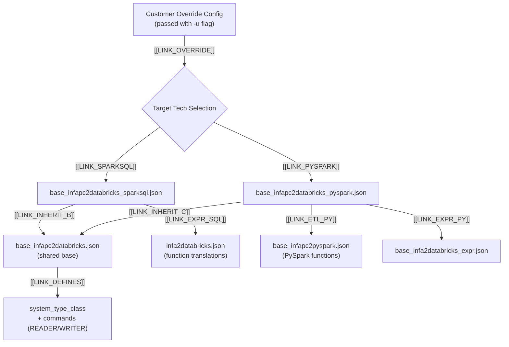

# Informatica PowerCenter to Databricks

## Getting Started

### Conversion Information

* **Transpiler**: BladeBridge
* **Conversion approach**: Lift and shift - the converter translates PowerCenter logic to equivalent Databricks code while preserving the original structure and flow
* **Available targets**: Databricks Notebooks (SparkSQL or PySpark)

### Supported PowerCenter Versions

- PowerCenter 9.x, 10.x
- PowerCenter Repository Services

### Input Requirements

Export your PowerCenter mappings and workflows as XML files using the PowerMart XML format:

1. **Repository Manager Export**: Use the Export Objects wizard in PowerCenter Repository Manager
2. **pmrep Command**: Use `pmrep objectexport` to export objects programmatically
3. **Designer Export**: Export from PowerCenter Designer (File → Export Objects)

**Export from Repository Manager:**
1. Open Repository Manager and connect to your repository
2. Select the folder(s) containing your mappings and workflows
3. Right-click → Export Objects
4. Choose "PowerMart XML" format
5. Save the `.xml` file

**Export using pmrep:**
```bash
pmrep connect -r REPOSITORY_NAME -d DOMAIN_NAME -n USERNAME -x PASSWORD
pmrep objectexport -o folder -n FOLDER_NAME -f exported_folder.xml
```

**Sample XML Structure:**
```xml
<?xml version="1.0" encoding="UTF-8"?>
<!DOCTYPE POWERMART SYSTEM "powrmart.dtd">
<POWERMART CREATION_DATE="06/05/2024 10:30:00" REPOSITORY_VERSION="187.96">
  <REPOSITORY NAME="REPO_NAME" VERSION="187" CODEPAGE="UTF-8" DATABASETYPE="Oracle">
    <FOLDER NAME="ETL_FOLDER" ...>
      <SOURCE ... />
      <TARGET ... />
      <MAPPING ... />
      <WORKFLOW ... />
    </FOLDER>
  </REPOSITORY>
</POWERMART>
```

---

## What Gets Converted

### High-Level Conversion Overview

PowerCenter objects are converted to their Databricks equivalents as follows:

| PowerCenter Object | Databricks Equivalent | Description |
|--------------------|----------------------|-------------|
| **Mapping** | Databricks Notebook | Each mapping is converted to a notebook containing PySpark or SparkSQL code (based on user selection) |
| **Session** | Databricks Notebook | Sessions execute mappings and are converted to notebook tasks |
| **Workflow** | Databricks Workflow | Workflows are converted to Databricks Workflow JSON definitions that orchestrate notebook execution |
| **Worklet** | Databricks Workflow | Reusable worklets are converted to separate Databricks Workflows |
| **Mapplet** | Shared Python Module | Reusable mapplets are converted to Python functions in a `shared_functions/` folder |

**Orchestration Flow:**

The converted Databricks Workflow calls individual PySpark or SparkSQL notebooks in sequence, mimicking the original execution flow of the PowerCenter workflow. Task dependencies, success/failure paths, and conditional logic are preserved in the workflow definition.

**Mapping Flow Preservation:**

The converter preserves the data flow of the original mapping. Transformations are processed in the same order as defined in PowerCenter, maintaining the logical sequence of operations from source to target.

**Session Overrides:**

Session-level and workflow-level overrides are taken into account during conversion. If SQL statements, connection properties, or other settings are overridden at the session or workflow level, the converted PySpark or SparkSQL code will reflect those overrides rather than the base mapping definitions.

**Naming Conventions:**

The converter preserves the original naming conventions for all artifacts - workflows, mappings, sessions, and individual transformation components. This makes it easy to correlate source PowerCenter objects with their converted Databricks equivalents during validation and debugging.

```
PowerCenter Workflow          →    Databricks Workflow JSON
    ├── Session 1 (Mapping A) →        ├── Notebook Task: mapping_a.py
    ├── Session 2 (Mapping B) →        ├── Notebook Task: mapping_b.py
    └── Worklet (sub-flow)    →        └── Nested Workflow Task
```

---

### Transformations - Supported

#### Source Components

| PowerCenter Component | Type | Spark Equivalent | Notes |
|-----------------------|------|------------------|-------|
| **Source Qualifier** | Source Qualifier | `spark.read` / SQL SELECT | Relational source reads |
| **Application Source Qualifier** | Source Qualifier | `spark.read` / SQL SELECT | Application-specific sources |
| **XML Source Qualifier** | Source Qualifier | `spark.read.format("xml")` | XML data sources |

#### Active Transformations

Active transformations can change the number of rows that pass through them. For example, a Filter removes rows, an Aggregator groups rows, and a Router splits rows into multiple output groups.

| PowerCenter Component | Type | Spark Equivalent | Notes |
|-----------------------|------|------------------|-------|
| **Expression** | Expression | SELECT with expressions | Column calculations |
| **Filter** | Filter | WHERE clause | Row filtering |
| **Router** | Router | Multiple WHERE clauses | Conditional routing to groups |
| **Aggregator** | Aggregator | GROUP BY | AVG, COUNT, MAX, MIN, SUM, etc. |
| **Joiner** | Joiner | JOIN (INNER, LEFT, RIGHT, FULL) | Sorted/unsorted joins |
| **Sorter** | Sorter | ORDER BY | Sorting operations |
| **Union Transformation** | Union | UNION ALL | Combine multiple sources |
| **Update Strategy** | Update Strategy | MERGE / Delta operations | INSERT, UPDATE, DELETE, REJECT |
| **Rank** | Rank | ROW_NUMBER / RANK | Ranking transformations |
| **Sequence Generator** | Sequence | MONOTONICALLY_INCREASING_ID | Sequence number generation |
| **Normalizer** | Normalizer | UNPIVOT / EXPLODE | VSAM and normalized data. Note: Normalizer as a source is currently not supported |

#### Passive Transformations

Passive transformations do not change the number of rows - every input row produces exactly one output row. These transformations modify or enrich data without affecting row counts.

| PowerCenter Component | Type | Spark Equivalent | Notes |
|-----------------------|------|------------------|-------|
| **Lookup** | Lookup Procedure | LEFT JOIN | Connected and unconnected lookups. Matching strategy (First, Last, Any, All matches) is preserved. Lookups are generated at the beginning of the script as prerequisite objects for easier tracing |
| **Stored Procedure** | Stored Procedure | spark.sql() with CALL | Procedure execution |

#### Target Components

| PowerCenter Component | Type | Spark Equivalent | Notes |
|-----------------------|------|------------------|-------|
| **Target Definition** | Target | INSERT INTO / Delta write | Relational and flat file targets |

#### Workflow Components

| PowerCenter Component | Type | Databricks Equivalent | Notes |
|-----------------------|------|----------------------|-------|
| **Workflow** | Orchestration | Databricks Workflow JSON | Job orchestration |
| **Session** | Execution | Notebook task | Mapping execution |
| **Worklet** | Reusable workflow | Nested workflow | Reusable workflow components |

### Transformations - Unsupported

The following transformations require manual conversion:

| PowerCenter Component | Reason |
|-----------------------|--------|
| **Java Transformation** | Custom Java code requires manual translation to Python |
| **External Procedure** | External calls need manual implementation |
| **Custom Transformation** | Custom logic requires manual conversion |
| **HTTP Transformation** | Implement using Python `requests` library |
| **SQL Transformation** | Review and adapt embedded SQL |

:::warning Custom Code
Transformations containing **custom Java code** or **stored procedures with complex logic** cannot be automatically converted. These require manual code translation to Python/SQL.
:::

---

### Sources and Targets

#### Supported Source Types

| Source Type | DATABASETYPE | System Class | Reader Command |
|-------------|--------------|--------------|----------------|
| Oracle | Oracle | RELATIONAL | `spark.read.jdbc()` / SQL |
| SQL Server | Microsoft SQL Server | RELATIONAL | `spark.read.jdbc()` / SQL |
| MySQL | MySQL | RELATIONAL | `spark.read.jdbc()` / SQL |
| Teradata | Teradata | RELATIONAL | `spark.read.jdbc()` / SQL |
| DB2 | DB2 | RELATIONAL | `spark.read.jdbc()` / SQL |
| Flat File | Flat File | FILE_DELIMITED | `spark.read.csv()` |
| Fixed Width | Flat File | FILE_FIXED | `spark.read.text()` with parsing |

#### Supported Target Types

| Target Type | System Class | Writer Command |
|-------------|--------------|----------------|
| Delta Lake | RELATIONAL | `INSERT INTO` / Delta write |
| Flat File | FILE_DELIMITED | `df.write.csv()` |

---

## Conversion Examples

### Expression Transformation

**PowerCenter Expression:**
```
Expression Transformation: exp_CALC_TOTALS
  Ports:
    GROSS_AMOUNT (Input)
    TAX_RATE (Input)
    NET_AMOUNT = GROSS_AMOUNT * (1 - TAX_RATE)
    PROCESS_DATE = SYSDATE
```

**Converted SparkSQL:**
```python
# Processing node exp_CALC_TOTALS, type EXPRESSION
exp_CALC_TOTALS = spark.sql(rf"""
SELECT
    GROSS_AMOUNT,
    TAX_RATE,
    GROSS_AMOUNT * (1 - TAX_RATE) AS NET_AMOUNT,
    CURRENT_TIMESTAMP() AS PROCESS_DATE
FROM source_table
""")
exp_CALC_TOTALS.createOrReplaceTempView("`exp_CALC_TOTALS`")
```

**Converted PySpark:**
```python
# Processing node exp_CALC_TOTALS, type EXPRESSION
exp_CALC_TOTALS = source_table.select(
    col("GROSS_AMOUNT"),
    col("TAX_RATE"),
    (col("GROSS_AMOUNT") * (1 - col("TAX_RATE"))).alias("NET_AMOUNT"),
    current_timestamp().alias("PROCESS_DATE")
)
```

### Lookup Transformation

**PowerCenter Lookup:**
```
Lookup Transformation: LKP_CUSTOMER
  Lookup Table: DIM_CUSTOMER
  Lookup Condition: CUST_ID = IN_CUST_ID
  Return Ports: CUST_NAME, CUST_REGION
  Cache: Full Cache
```

**Converted SparkSQL:**
```python
# Processing node LKP_CUSTOMER, type LOOKUP
LKP_CUSTOMER = spark.sql(rf"""
SELECT
    src.*,
    lkp.CUST_NAME,
    lkp.CUST_REGION
FROM source_table src
LEFT JOIN DIM_CUSTOMER lkp
    ON src.CUST_ID = lkp.CUST_ID
""")
LKP_CUSTOMER.createOrReplaceTempView("`LKP_CUSTOMER`")
```

### Router Transformation

**PowerCenter Router:**
```
Router Transformation: RTR_BY_REGION
  Groups:
    NORTH: REGION = 'NORTH'
    SOUTH: REGION = 'SOUTH'
    DEFAULT: (all other rows)
```

**Converted SparkSQL:**
```python
# Processing node RTR_BY_REGION, type ROUTER
# Group: NORTH
RTR_BY_REGION_NORTH = spark.sql(rf"""
SELECT * FROM source_table
WHERE REGION = 'NORTH'
""")
RTR_BY_REGION_NORTH.createOrReplaceTempView("`RTR_BY_REGION_NORTH`")

# Group: SOUTH
RTR_BY_REGION_SOUTH = spark.sql(rf"""
SELECT * FROM source_table
WHERE REGION = 'SOUTH'
""")
RTR_BY_REGION_SOUTH.createOrReplaceTempView("`RTR_BY_REGION_SOUTH`")

# Group: DEFAULT
RTR_BY_REGION_DEFAULT = spark.sql(rf"""
SELECT * FROM source_table
WHERE NOT (REGION = 'NORTH') AND NOT (REGION = 'SOUTH')
""")
RTR_BY_REGION_DEFAULT.createOrReplaceTempView("`RTR_BY_REGION_DEFAULT`")
```

### Aggregator Transformation

**PowerCenter Aggregator:**
```
Aggregator Transformation: AGG_SALES_BY_REGION
  Group By: REGION, PRODUCT_ID
  Aggregates:
    TOTAL_SALES = SUM(SALE_AMOUNT)
    AVG_PRICE = AVG(UNIT_PRICE)
    ORDER_COUNT = COUNT(ORDER_ID)
```

**Converted SparkSQL:**
```python
# Processing node AGG_SALES_BY_REGION, type AGGREGATOR
AGG_SALES_BY_REGION = spark.sql(rf"""
SELECT
    REGION,
    PRODUCT_ID,
    SUM(SALE_AMOUNT) AS TOTAL_SALES,
    AVG(UNIT_PRICE) AS AVG_PRICE,
    COUNT(ORDER_ID) AS ORDER_COUNT
FROM source_table
GROUP BY REGION, PRODUCT_ID
""")
AGG_SALES_BY_REGION.createOrReplaceTempView("`AGG_SALES_BY_REGION`")
```

### Joiner Transformation

**PowerCenter Joiner:**
```
Joiner Transformation: JNR_ORDER_CUSTOMER
  Join Type: Master Outer (RIGHT OUTER)
  Join Condition: MASTER.CUST_ID = DETAIL.CUST_ID
  Master: CUSTOMERS
  Detail: ORDERS
```

**Converted SparkSQL:**
```python
# Processing node JNR_ORDER_CUSTOMER, type JOINER
JNR_ORDER_CUSTOMER = spark.sql(rf"""
SELECT
    detail.*,
    master.CUST_NAME,
    master.CUST_ADDRESS
FROM ORDERS detail
RIGHT OUTER JOIN CUSTOMERS master
    ON master.CUST_ID = detail.CUST_ID
""")
JNR_ORDER_CUSTOMER.createOrReplaceTempView("`JNR_ORDER_CUSTOMER`")
```

### Update Strategy Transformation

**PowerCenter Update Strategy:**
```
Update Strategy Transformation: UPD_CUSTOMER
  Strategy Expression:
    IIF(ISNULL(EXISTING_KEY), DD_INSERT,
        IIF(CHANGE_FLAG = 'D', DD_DELETE, DD_UPDATE))
```

**Converted SparkSQL (with Delta MERGE):**
```python
# Processing node UPD_CUSTOMER, type UPDATE_STRATEGY
# Using Delta Lake MERGE for upsert operations
spark.sql(rf"""
MERGE INTO target_customer t
USING source_table s
ON t.CUST_ID = s.CUST_ID
WHEN MATCHED AND s.CHANGE_FLAG = 'D' THEN DELETE
WHEN MATCHED THEN UPDATE SET *
WHEN NOT MATCHED THEN INSERT *
""")
```

---

## Advanced Configuration

### Configuration Inheritance

BladeBridge uses a layered configuration system where configs inherit from base configs and can be overridden by customer-provided configs.



**Key Config Files:**

| Config File | Purpose |
|-------------|---------|
| `base_infapc2databricks_sparksql.json` | SparkSQL output generation |
| `base_infapc2databricks_pyspark.json` | PySpark output generation |
| `base_infapc2databricks.json` | Shared base configuration |
| `infa2databricks.json` | Date/time and function translations |
| `base_infapc2pyspark.json` | PySpark-specific function mapping |

### Custom Config Overrides

Customers can provide their own config file to extend or override default settings using the `-u` flag:

```bash
databricks labs lakebridge transpile \
  --source-dialect "informatica (desktop edition)" \
  --input-source /path/to/xml/files \
  --output-folder /output/notebooks \
  -u /path/to/my_custom_config.json
```

**Example Custom Config (inheriting from base):**
```json
{
  "inherit_from": ["base_infapc2databricks_sparksql.json"],
  
  "config_variables": {
    "ROOT_DELTA_DIR": "/mnt/delta/production",
    "USER_NAME": "etl_service_account"
  },
  
  "system_type_class": {
    "CUSTOM_DB": "RELATIONAL"
  },
  
  "pyspark_config": {
    "commands": {
      "READER_RELATIONAL": "spark.read.jdbc(url, table, properties)"
    }
  }
}
```

### Endpoint Type Dispatch

The converter automatically identifies source/target endpoint types and dispatches to the appropriate reader/writer logic.

**How Endpoint Types Are Identified:**

1. **Source/Target Definition** in XML contains `DATABASETYPE` attribute:
```xml
<SOURCE DATABASETYPE="Oracle" NAME="CUSTOMERS" ...>
```

2. **`system_type_class`** in config maps database types to categories:
```json
"system_type_class": {
  "ORACLE": "RELATIONAL",
  "MySQL": "RELATIONAL",
  "FLATFILE": "FILE_DELIMITED",
  "Flat File": "FILE_DELIMITED"
}
```

3. **`commands`** section defines reader/writer templates per category:
```json
"commands": {
  "READER_RELATIONAL": "spark.read.jdbc(...)",
  "READER_FILE_DELIMITED": "spark.read.csv(...)",
  "WRITER_RELATIONAL": "df.write.jdbc(...)",
  "WRITER_FILE_DELIMITED": "df.write.csv(...)"
}
```

**Dispatch Flow:**
```
XML DATABASETYPE → system_type_class mapping → READER/WRITER command template
```

### Column Conforming

When source columns need to be renamed to match expected component layouts (due to database case sensitivity or missing aliases), the converter generates column conforming code.

**Config Switches:**

| Switch | Description |
|--------|-------------|
| `conform_source_columns` | Enable column conforming when Source Qualifier doesn't generate explicit column list |
| `force_conform_source_columns` | Force conforming for flat file sources |
| `conform_columns_call_template` | Template for generating conforming code |

**Generated Conforming Code:**
```python
# Conforming fields names to the component layout
SQ_Source_conformed_cols = ["CUST_ID", "CUST_NAME", "CUST_REGION"]
SQ_Source = DatabricksConversionSupplements.conform_df_columns(
    SQ_Source, 
    SQ_Source_conformed_cols
)
```

**Helper Library (`databricks_conversion_supplements.py`):**
```python
class DatabricksConversionSupplements:
    @staticmethod
    def conform_df_columns(df: DataFrame, new_col_names: list) -> DataFrame:
        # Preserves sys_row_id and source_record_id if present
        if 'sys_row_id' in df.columns and 'sys_row_id' not in new_col_names:
            new_col_names.append('sys_row_id')
        return df.withColumnsRenamed(dict(zip(df.columns, new_col_names)))
```

### Function Mapping

PowerCenter functions are automatically translated to Spark equivalents. Here are a few examples:

| PowerCenter Function | Spark Equivalent |
|---------------------|------------------|
| `IIF(cond, true, false)` | `CASE WHEN cond THEN true ELSE false END` / `when().otherwise()` |
| `DECODE(val, ...)` | `CASE WHEN` expressions |
| `SYSDATE` | `CURRENT_TIMESTAMP()` |
| `TO_DATE(str, fmt)` | `to_date(str, fmt)` |
| `ADD_TO_DATE(dt, 'DD', n)` | `DATE_ADD(dt, n)` |
| `REPLACESTR(...)` | `REGEXP_REPLACE(...)` |

For a complete list of function mappings, refer to the config files:
- SparkSQL: `infa2databricks.json`
- PySpark: `base_infapc2pyspark.json`

---

## Next Steps

1. **Export PowerCenter mappings** to PowerMart XML format
2. **Run conversion** using Lakebridge CLI:
   
   **For SparkSQL output:**
   ```bash
   databricks labs lakebridge transpile \
     --source-dialect "informatica (desktop edition)" \
     --input-source /path/to/xml/files \
     --output-folder /output/sparksql \
     --target-technology sparksql
   ```
   
   **For PySpark output:**
   ```bash
   databricks labs lakebridge transpile \
     --source-dialect "informatica (desktop edition)" \
     --input-source /path/to/xml/files \
     --output-folder /output/pyspark \
     --target-technology pyspark
   ```

3. **Review generated notebooks** for conversion warnings and unsupported components
4. **Configure Databricks secrets** for connection strings
5. **Deploy helper library** (`databricks_conversion_supplements.py`) to your workspace
6. **Test with sample data** in Databricks
7. **Deploy workflows** to production

For more information, see:
- [Main ETL Conversion Guide](../../)
- [BladeBridge Configuration](../../pluggable_transpilers/bladebridge/bladebridge_configuration)
- [Transpile CLI Reference](../../)
